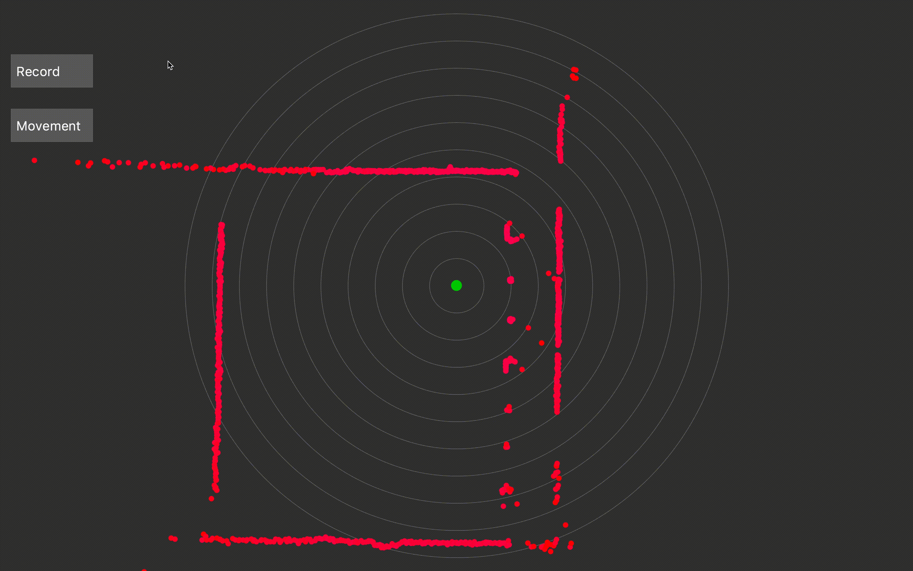

# Scanse Sweep Motion Tracking
Motion tracking using [scanse sweep](http://scanse.io/) in [processing](https://processing.org/)

## Getting Started
This software is using a  [sweep-processing](https://github.com/cansik/sweep-processing). Please download the latest release [here](https://github.com/cansik/sweep-processing/releases) and save it in your `Processing/libraries` folder.

Now open `lidar_visualizer/lidar_visualizer.pde` in Processing and run the file. __You may need to change number "3" in line 56 according to the port the sweep is connected.__ You can find all available ports in the Processing console after running the software.

## Detecting movement
### Live measurements
After running the Processing script, you will see the current scan measurements.

### Record environment
Please make sure that there is nobody visible in your room. You can now click on the _Record_ Button and wait until the environment is recorded (it waits 5 seconds till it records and then records 10 seconds).

### Show movement
You can now click on the _Movement_ Button and see all movements in the recorded environment.

 

 ## Built with
 - [sweep-processing](https://github.com/cansik/sweep-processing) - Sweep Library for Processing
 - [DBSCAN](https://github.com/chrfrantz/DBSCAN) - Used to cluster detected movement data
